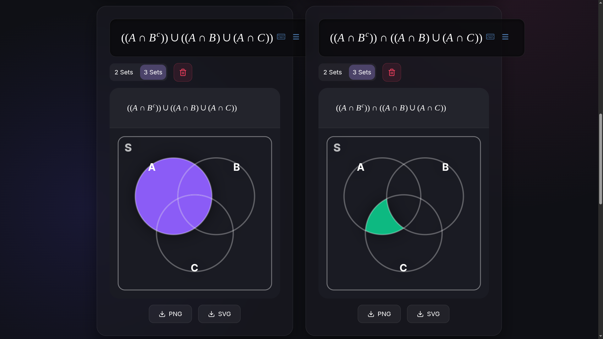

# Let's Learn Venn

An interactive **Set Theory visualizer** that makes abstract mathematics visual, tactile, and instant.

Type any set expression and watch a Venn diagram light up in real time. Click any region and the app writes the equation for you. Export your work as PNG or SVG.

This project combines a **LaTeX parser**, **Boolean logic minimizer**, and **geometric click detection** to deliver a Desmos-like experience for Set Theory.

---

## 🌐 Live Demo

👉 [https://shubham18024.github.io/Lets_Learn_Venn/](https://shubham18024.github.io/Lets_Learn_Venn/)

---

## 🖼️ Preview



*Two diagrams side-by-side: one showing A∪B with complement, another highlighting a precise A∩B∩C' region — each independently controlled.*

---

## 🧰 Tech Stack

<p align="center">
  
  
  
  
  
  
</p>

---

## ✨ Features

### 🔢 Real-Time Venn Visualization
- Supports **2-set** and **3-set** Venn diagrams
- Every region updates **instantly** as you type
- Universal Set boundary **S** is always visible

### ✏️ Desmos-Style Math Input
Type naturally using shortcuts — no need to know LaTeX:

| Type | Gets | Symbol |
|------|------|--------|
| `u` or `union` | `\cup` | A ∪ B |
| `i` or `intersection` | `\cap` | A ∩ B |
| `c` or `comp` | `^c` | A' (complement) |
| `diff` | `\setminus` | A \ B |
| `sym` | `\Delta` | A Δ B |

### 👆 Click-to-Equation (Touch Interaction)
Click any region on the Venn diagram — the app uses **Euclidean distance geometry** to identify the exact region and the **Quine–McCluskey Boolean minimizer** writes the simplest possible equation automatically.

### 🗂️ Multi-Diagram Workspace
- Add up to **5 independent diagrams** simultaneously
- Each diagram has its own editor, colour, and 2/3-set toggle
- Compare `A ∪ B` and `A ∩ B` visually side by side

### 🔗 Diagram Combiner
Pick any two diagrams and merge them with **Union (∪)** or **Intersection (∩)** to create a new derived diagram.

### 📥 Export
Download any diagram as a **PNG** or **SVG** — includes the equation printed above the diagram.

### 📖 Built-in Guide
Reference section covering all keyboard shortcuts, De Morgan's Laws, Distributive Laws, and Symmetric Difference — with visual examples.

---

## 🧠 Mathematics Inside

| Engine | Algorithm | Purpose |
|--------|-----------|---------|
| `LogicalParser.ts` | Recursive Descent Parser + Boolean Algebra | Evaluates `A ∪ B`, `A' ∩ C`, etc. over 8 Venn regions |
| `Minimizer.ts` | Quine–McCluskey (QMC) | Converts clicked regions → minimal LaTeX expression |
| `WorkspaceBlock.tsx` | Euclidean Distance Formula | Geometric click-to-region detection ($d = \sqrt{(x-cx)^2+(y-cy)^2}$) |
| SVG `clipPath` + `mask` | Set intersection / complement via SVG | Pixel-perfect region rendering without hand-drawn paths |

---

## 🚀 Local Development

```bash
# Clone
git clone https://github.com/Shubham18024/Lets_Learn_Venn.git
cd Lets_Learn_Venn

# Install
npm install

# Start dev server
npm run dev

# Build for production
npm run build
```

---

## 📦 Deployment

This project deploys automatically to **GitHub Pages** via GitHub Actions on every push to `main`.

See [`.github/workflows/deploy.yml`](.github/workflows/deploy.yml) for the full CI/CD pipeline.

To enable it on your fork:
1. Go to **Settings → Pages**
2. Set Source to **GitHub Actions**
3. Push to `main` — it deploys automatically ✅

---

## 📂 Project Structure

```
src/
├── engine/
│   ├── LogicalParser.ts     ← LaTeX → AST → boolean evaluation
│   └── Minimizer.ts         ← Truth vector → minimal LaTeX (QMC)
├── components/
│   ├── MathLiveInput.tsx    ← Rich math input with aliases
│   ├── WorkspaceBlock.tsx   ← Venn card with editor + SVG + download
│   └── Guide.tsx            ← Reference panel
├── App.tsx                  ← Workspace state (up to 5 diagrams)
└── index.css                ← Glassmorphic design system
```

---

## 🤝 Contributing

Please read [CONTRIBUTING.md](CONTRIBUTING.md).

High-impact areas:
- Add more set operation examples to the Guide
- Improve mobile touch handling
- Add 4-set ellipse-based Venn diagrams
- Better accessibility (keyboard navigation, ARIA labels)

---

## 📄 License

[MIT](LICENSE) © 2026 Shubham18024

---

## ⭐ Support

If this project helped you understand Set Theory better, please **star the repository** — it helps others find it!
